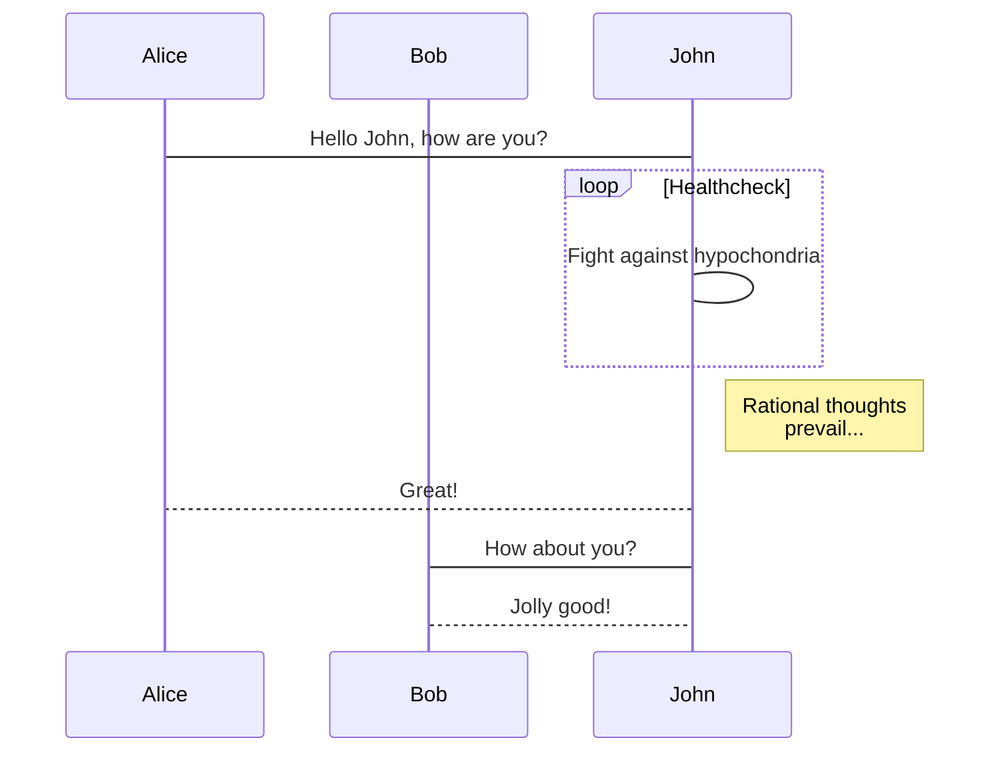

## 解决Git log 中乱码的方法
```
git config --global core.quotepath false 

git config --global gui.encoding utf-8

git config --global i18n.commit.encoding utf-8 

git config --global i18n.logoutputencoding utf-8

#在Window中添加环境变量 
LESSCHARSET=utf-8

```


